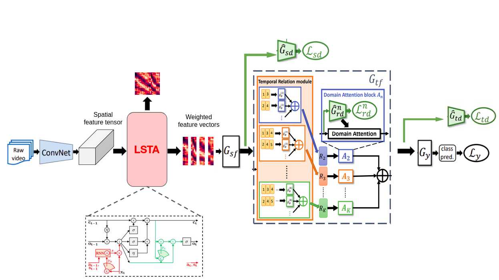

# LSTA<sup>3</sup>N for Egocentric Action Recognition

[](https://opensource.org/licenses/MIT)

The following repository faces a relatively new challenge in the field of computer vision: Domain Adaptation for Egocentric Action Recognition.
The proposed method focuses only on verb recognition and makes use of two well-known solution in this field: TA<sup>3</sup>N and LSTA.
This combination has led to a (naive) brand new architecture, called LSTA<sup>3</sup>N, tested on the EPIC-KITCHENS dataset

--------------------------------------------------------------

## Table of content
- [Description](#description)
- [Setup](#setup)
  - [Requirements](#requirements)
  - [Enviroment](#enviroment)
  - [Dataset and Features](#dataset-and-features)
- [Getting started](#getting-started)
    - [Configuration of parameters](#configuration-of-parameters)
    - [Train & Test](#train--test)
- [Contacts](#contacts)

--------------------------------------------------------------

## Description
Our architecture stems from the current state of the art for Unsupervised Domain Adaptation, namely TA<sup>3</sup>N.
TA<sup>3</sup>N extends a simple image-based domain adaptation network by adding a temporal module which learns different temporal relations. After that, a domain attention mechanism is applied, so that the network can align more those features which show highest domain discrepancy. In so doing, attention is considered only on the temporal dimension.
  
With our method, TA<sup>3</sup>N is fed with attentively weighted feature vectors obtained through LSTA. In this way, not only is attention performed on the spatial dimension as well, but we maintain an internal memory state for it, which implies a smooth track of the attention maps across time.

<p align="center"></p>
  
The ideas behind the project are inspired by the following papers and the corresponding GitHub repos.

| Paper | Title | Implementation source |
| ----- | ----- | --------------------- |
| [1907.12743](https://arxiv.org/abs/1907.12743) | Temporal Attentive Alignment for Large-Scale Video Domain Adaptation | [EPIC-KITCHENS-100_UDA_TA3N](https://github.com/jonmun/EPIC-KITCHENS-100_UDA_TA3N) |
| [1811.10698](https://arxiv.org/abs/1811.10698) | LSTA: Long Short-Term Attention for Egocentric Action Recognition | [LSTA](https://github.com/swathikirans/LSTA) |

--------------------------------------------------------------

## Setup

### Requirements
1. The project has been tested on Linux (Ubuntu 18.04), MacOS and Windows (10)
2. Python 3.6+ version is needed
3. Good NVIDIA GPU (4GB+) is strongly suggested but it's not mandatory
4. RAM size depends on the dimension of the spatial feature tensors. In the tested configuration, not less than 32GB were required.
5. If you wish to see the execution graph through TorchViz library, you have to manually install the "graphviz" library on your system and then set the `draw_execution_graphs` as true.

### Enviroment
Once the repo is cloned, some python libraries are required to properly setup your (virtual) enviroment.


They can be installed via pip:
```bash
    pip install -r requirements.txt
```

or via conda:
```bash
    conda create --name <env_name> --file requirements.txt
```

### Dataset and Features
EPIC KITCHENS dataset can be found [here](https://epic-kitchens.github.io/2022). 

Though it is possible to download every single video, this project's scripts are based on pre-extracted spatial features. Features' shape should be `[Batch, N°Channels, N°Frames, Width, Height]`. In our case, the features were extracted from the last convolutional layer block of a TSM applied to RGB frames. Therefore, `batch_size = 2048` and `n_channel = 3` .

Three different domains have been selected to perform domain shift: `P08, P01 and P22`, respectively known in this project as `D1, D2 and D3`.

--------------------------------------------------------------

## Getting started

* `dataset/` : loads and handles Epic Kitchens dataset
* `model/`
    * `LSTA/` : LSTA folder with built-in attention module and convolutional cell's structure
    * `TRN_module.py` : frame-aggregation module
    * `module.py` : configures all parameters and creates the main object that will be run in `main.py`
* `utils/`
    * `loss.py` : different types of loss function
    * `options.py` : configuration list of parameters to build VideoModel

### Configuration of parameters
`options.py` needs a brief configuration in order to correctly build VideoModel. Description for most parameters is given. Those which need more attention are:

* *dropout_v* : randomly zeroes some of the elements of the input tensor with probability p, preventing the co-adaptation of neurons
* *dann* : decreses progressively learning rate at each epoch; alternatively, it can be reduced by *lr_decay* every *lr_steps* epoch
* *place_adv* : booleans prescribing what losses are meant to be considered in the TA3N module; these are video relation-based adversarial loss, video-based adversarial loss, frame-based adversarial loss
* *use_attn* : boolean. Whether to apply domain attention or not.
* *beta* : weights of loss described in *place_adv*
* *gamma* : weight for the attentive entropy loss

### Train & Test
Before running `main.py` you need to choose NVIDIA GPU or CPU as processing unit. The device used to run this project is dynamically selected between `.cuda()` (which is the prefered option) or `.cpu()` (which is selected if and only if the first one is not avaiable). Therefore, in command line:

```bash
    python main.py
```
and it will perform both train and test.

--------------------------------------------------------------

## Contacts

| Author | Mail | GitHub | 
| ------ | ---- | ------ |
| **Lorenzo Bergadano** | s304415@studenti.polito.it | [lolloberga](https://github.com/lolloberga) |
| **Matteo Matteotti** | s294552@studenti.polito.it | [mttmtt31](https://github.com/mttmtt31) |
| **Paolo Rizzo** | paolo.rizzo@studenti.polito.it | [polrizzo](https://github.com/polrizzo) |


